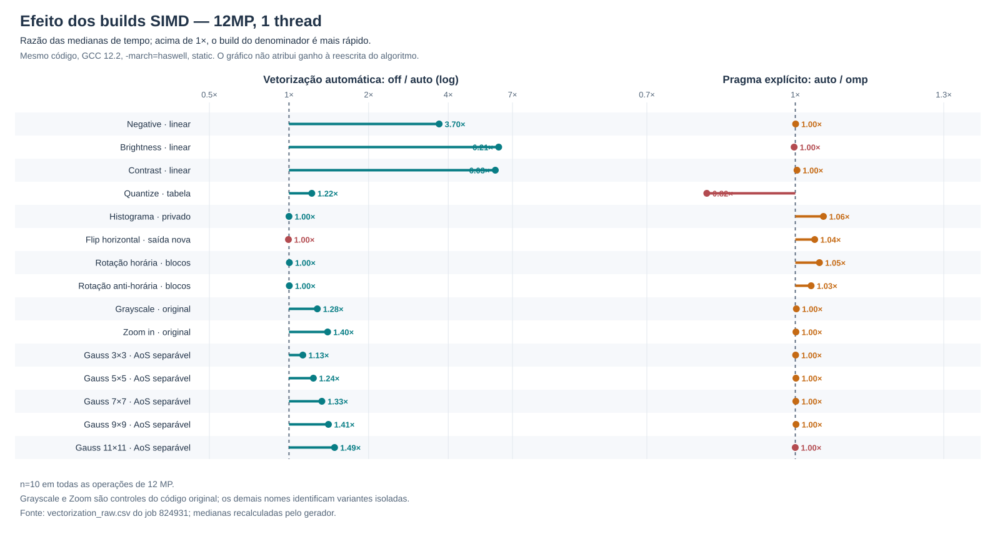
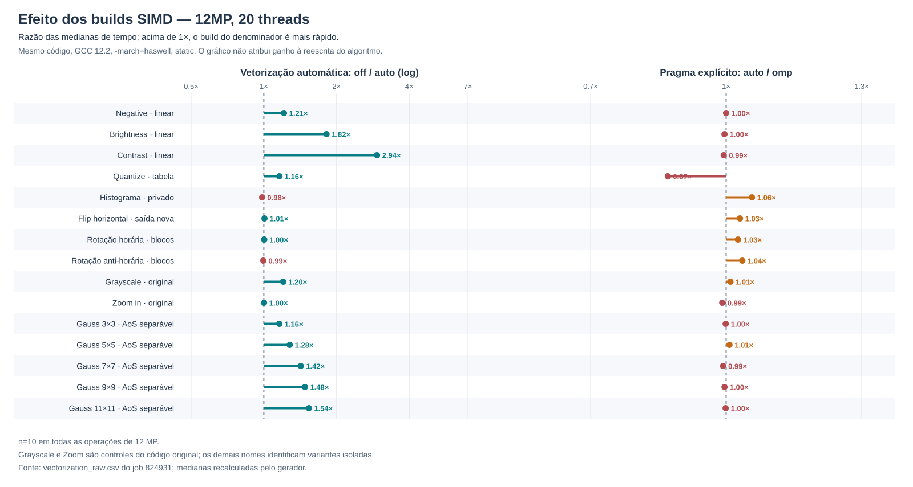
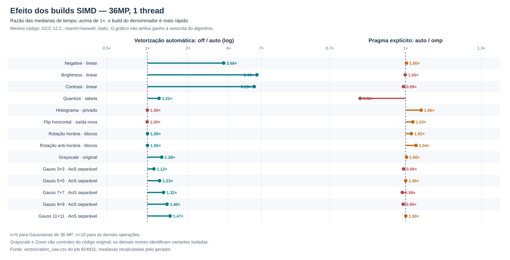
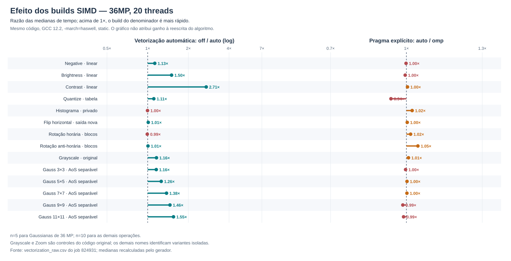
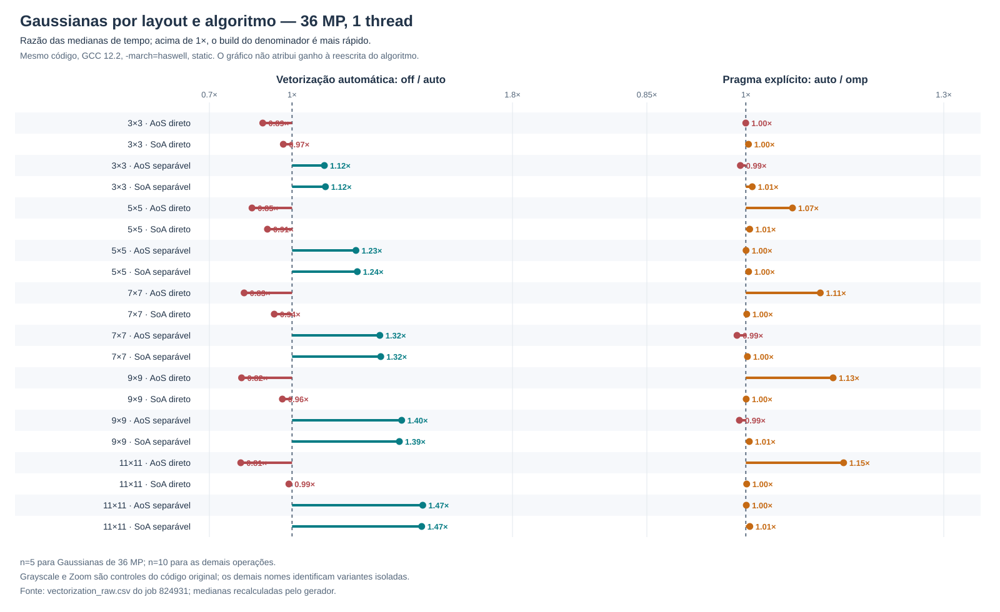
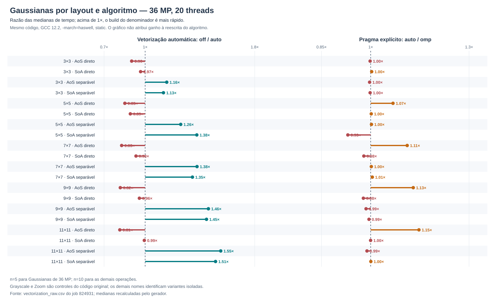

# Auditoria dos laços SIMD das reescritas — job 824931

## Escopo e critério

Este relatório complementa a [auditoria das 17 operações originais](RELATORIO_LOOPS_SIMD_17_OPERACOES.md). Examina as variantes isoladas em [`vectorization_benchmark.cpp`](577262-FPI-Relatorio2/vectorization_benchmark.cpp) e as medições do job **824931** no hype, sem substituir as funções de produção. A nova campanha contém **15 operações**: Flip Vertical e Zoom Out não receberam candidatos; Grayscale e Zoom In são controles que continuam chamando o código original. As cinco Gaussianas usam as mesmas quatro funções parametrizadas pelo número de taps.

Evidência primária: [CSV bruto](resultados_pcad_hype_vectorization_824931/vectorization_raw.csv), [resumo](resultados_pcad_hype_vectorization_824931/vectorization_summary.csv), diagnósticos completos do GCC 12.2 para [`auto-avx2`](resultados_pcad_hype_vectorization_824931/auto-avx2-compiler.txt), [`omp-avx2`](resultados_pcad_hype_vectorization_824931/omp-avx2-compiler.txt) e [funções originais](resultados_pcad_hype_vectorization_824931/omp-avx2-original-core-compiler.txt). O job registra o commit `6b134bbfa340df58d7ca5107973ff4e8fbdf46dc` em [`git_commit.txt`](resultados_pcad_hype_vectorization_824931/git_commit.txt). O [script da campanha](run_vectorization_tests.sh) fixa `OMP_SCHEDULE=static`, usa 1 e 20 threads, imagens de 12 e 36 MP, um aquecimento e dez amostras; as Gaussianas de 36 MP têm cinco. Zoom In não foi executado em 36 MP. O alvo é Haswell nos três builds:

| Build | Vetorizador de laços | `EXP_SIMD` | Comparação controlada |
| --- | --- | --- | --- |
| `off-avx2` | desativado por `-fno-tree-vectorize` | vazio | código sem vetorização de laços; **não** significa ausência de toda instrução SSE/AVX |
| `auto-avx2` | ativo | vazio | efeito de deixar o GCC vetorizar automaticamente |
| `omp-avx2` | ativo | `_Pragma("omp simd")` | efeito **incremental** do pragma explícito |

O pragma aparece no fonte como macro, definido nas [linhas 27–34](577262-FPI-Relatorio2/vectorization_benchmark.cpp#L27):

```cpp
#if OMP_EXPLICIT_SIMD
#define EXP_SIMD _Pragma("omp simd")
#else
#define EXP_SIMD
#endif
```

Assim, todo `EXP_SIMD` mostrado abaixo **é `#pragma omp simd` somente no build `omp-avx2`**. `#pragma omp parallel for schedule(runtime)` distribui iterações entre threads; não é evidência de vetorização SIMD. `V32` significa mensagem do GCC `optimized: loop vectorized using 32 byte vectors`; algumas regiões também têm caminho V16 para resto. `N` significa ausência de confirmação positiva e, onde indicado, mensagem explícita de recusa. Linhas `missed` e `optimized` podem surgir para transformações diferentes da mesma região: uma recusa não anula um `optimized` identificado para o laço relevante. Uma instrução vetorial isolada, `memset` ou laço auxiliar vetorizado não prova que a varredura principal de pixels foi vetorizada.

As razões dos gráficos e da tabela de tempos são **razões de medianas**, não médias de razões: `off/auto` isola o vetorizador automático na mesma variante; `auto/omp` isola o acréscimo do pragma na mesma variante. Razão maior que 1 indica que o denominador foi mais rápido. `Original_to_Variant`, quando usado, é comparação de **código/algoritmo** dentro do mesmo build, não um ganho SIMD.

## 1. Operações ponto a ponto: Negative, Brightness e Contrast

Fonte: [linhas 166–197](577262-FPI-Relatorio2/vectorization_benchmark.cpp#L166). Os três laços de linhas são `#pragma omp parallel for schedule(runtime)`; as threads recebem linhas. Cada laço interno percorre os **`width*3` bytes RGB contíguos**, sem o antigo laço de três canais por pixel:

```cpp
// Negative, linha 173
EXP_SIMD
for (int byte = 0; byte < width * 3; ++byte)
    row[byte] = static_cast<Byte>(255 - row[byte]);

// Brightness, linhas 181–183
EXP_SIMD
for (int byte = 0; byte < width * 3; ++byte)
    row[byte] = static_cast<Byte>(std::clamp(static_cast<int>(row[byte]) + 127, 0, 255));

// Contrast, linhas 191–195
EXP_SIMD
for (int byte = 0; byte < width * 3; ++byte) {
    const float value = row[byte] * 1.5f;
    row[byte] = static_cast<Byte>(std::clamp(static_cast<int>(value), 0, 255));
}
```

| Laço | Papel | `auto-avx2` | `omp-avx2` | Leitura |
| --- | --- | --- | --- | --- |
| Negative **173** | `255 - byte` | **V32 + V16** | **V32 + V16** | a aritmética e o acesso linear permitem vetorizar sem pragma |
| Brightness **182/183** | soma e saturação | **V32 + V16** | **V32** | o pragma muda a forma compilada, mas não traz ganho relevante |
| Contrast **192** | multiplicação, conversão e saturação | **V32 + V16** | **V32** | mesmo com float por byte, GCC vetoriza o laço linear |

Na versão anterior, os laços de pixels em Negative **892**, Brightness **1016** e Contrast **907** tinham um `for(channel < 3)` interno e não receberam confirmação de vetorização. Isso é o contraste de código mais direto da campanha. Com 36 MP e 1 thread, `off/auto` é respectivamente **3,68×**, **6,48×** e **6,19×**; `auto/omp` fica próximo de **1,00×**. A reescrita contra a implementação antiga, no mesmo `omp-avx2`, rende **7,49×**, **12,89×** e **9,18×** em 1 thread, mas mistura melhoria do acesso/laço e SIMD. Não atribuir esses três números somente ao AVX2.

## 2. Quantize: redução já vetorizada e lookup forçado pelo pragma

Fonte: [linhas 199–219](577262-FPI-Relatorio2/vectorization_benchmark.cpp#L199) e [449–469](577262-FPI-Relatorio2/vectorization_benchmark.cpp#L449). A candidata ainda chama `apply_gray_scale_inplace` e `find_min_and_max_luminance_on_gray_scale_image`: seus laços de pixels, nas linhas **979** e **1079** do núcleo original, têm **V32 + V16** nos builds auto/omp. O preparo da pequena tabela (`value < 256`, linha **204**) não é confirmado como laço vetorizado relevante. O novo laço grande é:

```cpp
#pragma omp parallel for schedule(runtime)
for (int y = 0; y < height; ++y) {
    EXP_SIMD
    for (int x = 0; x < width; ++x) {       // linha 211
        const size_t index = (static_cast<size_t>(y) * width + x) * 3;
        const Byte result = table[data[index]];
        data[index] = result;
        data[index + 1] = result;
        data[index + 2] = result;
    }
}
```

O laço de pixels **211** é **N em `auto-avx2`**, mas **V32 + V16 em `omp-avx2`**. É a demonstração mais limpa de que o pragma mudou a decisão do GCC. Contudo, vetorização forçada não garante velocidade: em 36 MP/20 threads, a fase `lookup` passa de **3,68 ms** para **4,32 ms** e o total de **11,32 ms** para **12,06 ms** (`auto/omp = 0,94×`). Em 1 thread, o total passa de **114,43 ms** para **139,58 ms** (`0,82×`). O custo da consulta indexada, conversão RGB e armazenamento pode superar o benefício do paralelismo SIMD nessa forma; o relatório do compilador sozinho não isola qual instrução causa a regressão.

## 3. Equalize Histogram: separar contagem, redução e remapeamento

Fonte: [linhas 221–255](577262-FPI-Relatorio2/vectorization_benchmark.cpp#L221). O candidato usa um histograma privado de 256 bins por thread; esse isolamento elimina disputa entre threads, mas não torna a atualização indexada por pixel independente dentro do vetor.

```cpp
#pragma omp for schedule(runtime)
for (int y = 0; y < input.height; ++y)
    for (int x = 0; x < input.width; ++x) { // linha 229: contagem
        const size_t index = (static_cast<size_t>(y) * input.width + x) * 3;
        const Byte r = input.bytes[index], g = input.bytes[index + 1], b = input.bytes[index + 2];
        const Byte gray = static_cast<Byte>(0.299 * r + 0.587 * g + 0.114 * b);
        ++bins[gray];
    }

for (const auto& bins : private_bins)
    for (size_t bin = 0; bin < output.size(); ++bin) // linha 239: fusão
        output[bin] += bins[bin];

for (size_t bin = 1; bin < bins.size(); ++bin) // linha 244: prefixo
    bins[bin] += bins[bin - 1];
for (auto& value : bins) value = std::round(value * factor); // linha 245

#pragma omp parallel for schedule(runtime)
for (int y = 0; y < height; ++y) {
    EXP_SIMD
    for (int byte = 0; byte < width * 3; ++byte) // linha 253: remapeamento
        row[byte] = static_cast<Byte>(bins[row[byte]]);
}
```

| Etapa | `auto-avx2` | `omp-avx2` | Motivo/limite |
| --- | --- | --- | --- |
| Contagem RGB **229** | **N** | **N** | `++bins[gray]` é atualização indireta e pode repetir o mesmo índice entre iterações |
| Fusão dos 256 bins **239** | **V32** | **V32** | laço pequeno por bins; **não** é a leitura da imagem |
| Prefixo **244** | **N** | **N** | dependência `bins[i]` de `bins[i-1]` |
| Normalização **245** | **N** | **N** | cálculo `float`/`round` nessa forma recusado pelo GCC |
| Remapeamento **253** | **N** | **V32 + V16** | pragma induz o laço de bytes com lookup indexado |

Em 36 MP/20 threads, a fase de remapeamento melhora de **4,34** para **4,08 ms**, mas a contagem ainda leva aproximadamente **8,7 ms**; o ganho total do pragma é só **1,02×**. A versão antiga também vetorizava um laço de *combinação de bins* gerado pela redução OpenMP, não a contagem dos pixels. Portanto, a nova implementação **não resolveu a vetorização da fase dominante**.

## 4. Gaussianas 3×3, 5×5, 7×7, 9×9 e 11×11

As cinco operações passam pelas mesmas funções abaixo com `taps=3,5,7,9,11`. Todas as quatro variantes produzem bytes iguais entre si. A Gaussiana de produção em float (`production_float`) é uma referência adicional de outro escopo: inclui alocação interna e pode divergir um nível por arredondamento, portanto não é o denominador dos gráficos.

### 4.1 AoS direto e SoA direto: vetorizar taps não é vetorizar pixels

Fonte: [linhas 292–337](577262-FPI-Relatorio2/vectorization_benchmark.cpp#L292).

```cpp
// AoS direto: três canais acumulados para cada pixel.
#pragma omp parallel for schedule(runtime)
for (int y = 0; y < output.height; ++y) {
    EXP_SIMD
    for (int x = 0; x < output.width; ++x) { // 299: N
        uint64_t sums[3]{};
        for (int dy = 0; dy < taps; ++dy)    // 301: N
            for (int dx = 0; dx < taps; ++dx) { // 302: V32
                const uint64_t weight = static_cast<uint64_t>(weights[dy]) * weights[dx];
                const size_t source = ((y + dy) * input.width + x + dx) * 3;
                for (int channel = 0; channel < 3; ++channel) // 305: sem V confirmado
                    sums[channel] += weight * input.bytes[source + channel];
            }
        /* normaliza e grava RGB: laço de 3 canais, sem V confirmado */
    }
}

// SoA direto: repete um canal inteiro por vez.
for (int channel = 0; channel < 3; ++channel) {
    #pragma omp parallel for schedule(runtime)
    for (int y = 0; y < out_height; ++y) {
        EXP_SIMD
        for (int x = 0; x < out_width; ++x) { // 328: N
            uint64_t sum = 0;
            for (int dy = 0; dy < taps; ++dy) // 330: N
                for (int dx = 0; dx < taps; ++dx) // 331: V32
                    sum += weights[dy] * weights[dx] * source[(y + dy) * width + x + dx];
            target[y * out_width + x] = static_cast<Byte>((sum + divisor / 2) / divisor);
        }
    }
}
```

Nos dois builds vetorizadores, o GCC confirma **V32 apenas em `dx` (302/331)**. Os `EXP_SIMD` nas linhas **298/327** **não obtiveram a vetorização da varredura `x`**. AoS↔SoA, linhas **268/281**, também tem pragma no build explícito, mas **N** nos laços de pixels. Isso importa porque o total de SoA inclui as duas conversões.

```cpp
// Conversão de entrada AoS → SoA, linha 268: N em auto e omp.
#pragma omp parallel for schedule(runtime)
for (int y = 0; y < input.height; ++y) {
    EXP_SIMD
    for (int x = 0; x < input.width; ++x) {
        const size_t pixel = static_cast<size_t>(y) * input.width + x;
        output.r[pixel] = input.bytes[pixel * 3];
        output.g[pixel] = input.bytes[pixel * 3 + 1];
        output.b[pixel] = input.bytes[pixel * 3 + 2];
    }
}

// A conversão de saída SoA → AoS, linha 281, inverte as atribuições.
```

Para 11×11, 36 MP/20 threads, AoS direto leva **514,23 ms** (`auto-avx2`); SoA direto, incluindo conversões, **664,98 ms**. Além disso, AoS direto fica **mais lento** com o vetorizador automático do que com ele desligado: **419,09 → 514,23 ms** em 20 threads (`off/auto = 0,81×`). O código confirma *qual* laço vetorizou, mas não prova sozinho se a piora vem da vetorização dos taps, do custo de instruções geradas ou de outra transformação do compilador. Uma análise de montagem/contadores por função seria necessária para atribuir a causa fina.

### 4.2 AoS e SoA separáveis: o pixel/byte passa a ser o laço interno

Fonte: [linhas 340–390](577262-FPI-Relatorio2/vectorization_benchmark.cpp#L340).

```cpp
#pragma omp parallel for schedule(runtime)
for (int y = 0; y < height; ++y) {
    EXP_SIMD
    for (int byte = 0; byte < row_size; ++byte) row[byte] = 0; // 351: memset
    for (size_t tap = 0; tap < weights.size(); ++tap) {
        const Byte* source_row = /* linha deslocada pelo tap */;
        EXP_SIMD
        for (int byte = 0; byte < row_size; ++byte) // 356/357: V32
            row[byte] += weight * source_row[byte];
    }
}

#pragma omp for schedule(runtime)
for (int y = 0; y < out_height; ++y) {
    EXP_SIMD
    for (int byte = 0; byte < row_size; ++byte) sum[byte] = 0; // 377: memset
    for (size_t tap = 0; tap < weights.size(); ++tap) {
        EXP_SIMD
        for (int byte = 0; byte < row_size; ++byte) // 382/383: V32
            sum[byte] += weight * source_row[byte];
    }
    EXP_SIMD
    for (int byte = 0; byte < row_size; ++byte) // 387: N
        destination[byte] = static_cast<Byte>((sum[byte] + divisor / 2) / divisor);
}
```

O laço `tap` é **externo ao laço de bytes dentro de cada linha**; cada iteração interna percorre endereços contíguos. O GCC confirma V32 nos laços de acumulação horizontal **356/357** e vertical **382/383** em `auto-avx2` **e** `omp-avx2`. Inicializações **351/377** viraram `memset`; isso não é uma confirmação de laço SIMD. A normalização/gravação **387** não tem confirmação de vetorização; divisão inteira de acumuladores largos é uma limitação plausível, mas a mensagem de GCC por si só não quantifica seu custo. SoA executa as passadas para R, G e B separadamente e ainda paga `unpack` e `pack`; AoS separável opera diretamente no RGB intercalado.

Para 11×11, 36 MP/20 threads, **AoS separável** mede **114,91 ms** em `auto-avx2` contra **514,23 ms** do AoS direto, razão **4,48×**. Entretanto, mesmo em `off-avx2`, separável já ganha **2,35×**: o ganho total mistura redução algorítmica de aproximadamente 121 para 22 contribuições por pixel e melhor disposição dos laços para SIMD. A passagem AoS separável isolada ganha mais **1,55×** com vetorização automática, enquanto `omp simd` não acrescenta ganho (`auto/omp = 0,99×`). No mesmo teste, SoA separável totaliza **114,85 ms**, praticamente igual ao AoS separável; a diferença de décimos de milissegundo não sustenta superioridade de layout, sobretudo porque a ordem das quatro variantes é fixa no benchmark.

## 5. Flip Horizontal e rotações: pragma sem laço principal vetorizado

Fonte: [linhas 393–426](577262-FPI-Relatorio2/vectorization_benchmark.cpp#L393).

```cpp
// Flip out-of-place
#pragma omp parallel for schedule(runtime)
for (int y = 0; y < input.height; ++y) {
    EXP_SIMD
    for (int x = 0; x < input.width; ++x) { // 397: N
        const size_t source = (y * input.width + input.width - 1 - x) * 3;
        const size_t target = (y * input.width + x) * 3;
        output.bytes[target]     = input.bytes[source];
        output.bytes[target + 1] = input.bytes[source + 1];
        output.bytes[target + 2] = input.bytes[source + 2];
    }
}

// Rotações, mesmo laço para CW e CCW
#pragma omp parallel for collapse(2) schedule(runtime)
for (int bx = 0; bx < x_tiles; ++bx)
    for (int by = 0; by < y_tiles; ++by)
        for (int x = bx * tile; x < std::min(input.width, (bx + 1) * tile); ++x) {
            EXP_SIMD
            for (int y = by * tile; y < std::min(input.height, (by + 1) * tile); ++y) { // 416: N
                const size_t target_pixel = clockwise
                    ? (input.width - 1 - x) * input.height + y
                    : x * input.height + input.height - 1 - y;
                /* copia três canais */
            }
        }
```

Flip **397** e rotação **416** são **N em auto e omp**, mesmo com `EXP_SIMD` no build explícito. O `collapse(2)` da rotação distribui *tiles entre threads*, não vetoriza pixels. A geometria e os grupos de três bytes continuam difíceis para o vetorizador. A candidata Flip ainda troca uma transformação *in-place* por uma saída nova. Em 36 MP/20 threads, seu `total` é **41,68 ms** versus **6,26 ms** do original, mas **35,10 ms** são `allocation`/inicialização do buffer; seu kernel isolado fica em **6,54 ms**. Logo, a razão total não mede somente eficiência do laço. As rotações não demonstram ganho SIMD consistente e têm gerenciamento de buffers diferente do original.

## 6. Controles sem reescrita: Grayscale e Zoom In

O executável chama [`apply_gray_scale_inplace`](577262-FPI-Relatorio2/vectorization_benchmark.cpp#L611) e [`zoom_in_image_to_buffer`](577262-FPI-Relatorio2/vectorization_benchmark.cpp#L620). Não há `EXP_SIMD` novo nesses controles: os pragmas são os `OMP_SIMD` do [código original](577262-FPI-Relatorio2/image_manipulation.cpp), que também se expandem somente quando `OMP_EXPLICIT_SIMD=1`. No job atual, GCC confirma **V32 + V16** no laço de pixels do Grayscale, linha **979**, e na fase de interpolação vertical do Zoom In, linha **714**, tanto em auto como em omp. As fases de cópia **689** e interpolação horizontal **701** do Zoom continuam sem confirmação. Em 12 MP/1 thread, o Zoom `off/auto` é **1,40×**; em 20 threads, **1,00×**. O ganho incremental do pragma é aproximadamente **1,00×** nos dois casos. Grayscale tem `off/auto` de **1,28×** em 1 thread e **1,16×** em 20.

Trechos dos laços de controle (aqui `OMP_SIMD`, não `EXP_SIMD`, é o macro do código de produção):

```cpp
// Grayscale, linha 979: V32 + V16 em auto e omp.
OMP_SIMD
for (int i = 0; i < width; i++) {
    int index = (j * width + i) * 3;
    unsigned char r = data[index];
    unsigned char g = data[index + 1];
    unsigned char b = data[index + 2];
    unsigned char gray = (unsigned char)(0.299 * r + 0.587 * g + 0.114 * b);
    data[index] = data[index + 1] = data[index + 2] = gray;
}

// Zoom In, fase vertical, linha 714: V32 + V16 em auto e omp.
OMP_SIMD
for(int i = 0; i < new_width; i++){
    int index = (j * new_width + i) * 3;
    destination[index] = (unsigned char) ((destination[index - new_width * 3] + destination[index + new_width * 3]) / 2);
    destination[index + 1] = (unsigned char) ((destination[index - new_width * 3 + 1] + destination[index + new_width * 3 + 1]) / 2);
    destination[index + 2] = (unsigned char) ((destination[index - new_width * 3 + 2] + destination[index + new_width * 3 + 2]) / 2);
}
```

## Comparação com as 17 operações originais

O contraste de código não depende de uma mudança de formato de arquivo: a imagem continua sendo RGBRGB. O que mudou foi **qual dimensão do armazenamento o laço interno percorre**. Por exemplo, o Negative antigo tinha:

```cpp
// image_manipulation.cpp, linhas 890–895: laço de pixels N no GCC 824453
for(int i = 0; i < img.height; i++){
    OMP_SIMD
    for(int j = 0; j < img.width; j++){
        int index = (i * img.width + j) * 3;
        for(int channel = 0; channel < 3; channel++){
            img.data[index + channel] = 255 - img.data[index + channel];
        }
    }
}
```

O candidato mantém uma linha por thread, mas seu laço SIMD interno percorre `byte=0..width*3-1` sem outro laço de canais. A representação física não mudou; a estrutura do laço mudou. Nas Gaussianas originais, o `OMP_SIMD` ficava no laço de pixels que chamava `apply_N_by_N_convolution_to_pixel`, preservando os laços de taps *dentro* de cada pixel. Na candidata separável, cada tap alimenta uma varredura contígua da linha. Essas são alterações de algoritmo e ordem dos laços, não apenas de flag do compilador.

| Caminho da versão anterior | Diagnóstico anterior de laço de pixels | Resultado da reescrita 824931 |
| --- | --- | --- |
| Negative, Brightness, Contrast | pixels com `for(channel<3)` interno, **N** apesar de `OMP_SIMD` | bytes RGB lineares **V32** já em `auto-avx2`; `omp` não é necessário para obter esse laço |
| Quantize | Grayscale/min-max **V32**; quantização final **N** | lookup final **N auto → V32 omp**, mas fica mais lento |
| Equalize Histogram | combinação dos bins **V32**; contagem e remapeamento **N** | contagem ainda **N**, fusão **V32**, remapeamento **V32 somente omp**; ganho total pequeno |
| Gaussianas 3–11 | varredura RGB direta de pixels **N** | direta ainda tem pixels **N**, mas taps `dx` **V32**; separável passa a ter bytes por linha **V32** |
| Flip Horizontal, Rotate CW/CCW | laços principais **N** | candidatos ainda **N**, apesar de novos pragmas |
| Grayscale, Zoom In | Grayscale e fase vertical do Zoom **V32** | mesmo comportamento: são controles, não reescritas |
| Flip Vertical, Zoom Out | **N** no relatório anterior | **fora da campanha**; nenhuma conclusão nova |

Esta comparação é sustentada pelo [relatório anterior](RELATORIO_LOOPS_SIMD_17_OPERACOES.md) e pelo relatório GCC do [job 824453](resultados_pcad_hype_compiler_evidence_824453/omp-avx2/image_manipulation.opt-info.txt). Para os tempos, o job 824931 executa o original e o candidato no mesmo protocolo. Não é preciso misturar diretamente tempos de campanhas antigas, que poderiam ter escopo, compilação e amostragem diferentes.

A lição não é que "AVX2 sempre acelera", nem que o pragma sozinho corrige um laço difícil. **Código com iterações independentes e acesso adequado torna a vetorização possível; o GCC escolhe quais laços transformar e pode fazê-lo automaticamente; a decisão vetorial ainda precisa ser julgada pelos tempos.** A Gaussiana direta e o lookup do Quantize são contraexemplos mensurados de vetorização sem ganho.

## Tempos e limites da inferência

Na tabela, cada célula contém `off/auto ; auto/omp`, usando `Phase=total`. As operações em 36 MP têm cinco amostras para Gaussianas e dez para as demais. Zoom usa 12 MP. É um panorama, não uma inferência de significância estatística para diferenças de 1–3%.

| Operação/variante | 1 thread | 20 threads |
| --- | ---: | ---: |
| Negative linear | **3,68× ; 1,00×** | **1,13× ; 1,00×** |
| Brightness linear | **6,48× ; 1,00×** | **1,50× ; 1,00×** |
| Contrast linear | **6,19× ; 0,99×** | **2,71× ; 1,00×** |
| Quantize LUT | **1,22× ; 0,82×** | **1,11× ; 0,94×** |
| Equalize private | **1,00× ; 1,06×** | **1,00× ; 1,02×** |
| Flip out-of-place | **1,00× ; 1,03×** | **1,01× ; 1,00×** |
| Rotate CW blocked | **1,00× ; 1,02×** | **0,99× ; 1,02×** |
| Rotate CCW blocked | **1,00× ; 1,04×** | **1,01× ; 1,05×** |
| Grayscale original | **1,28× ; 1,00×** | **1,16× ; 1,01×** |
| Zoom In original, 12 MP | **1,40× ; 1,00×** | **1,00× ; 0,99×** |
| Gauss 3×3 AoS separável | **1,12× ; 0,99×** | **1,16× ; 1,00×** |
| Gauss 5×5 AoS separável | **1,23× ; 1,00×** | **1,26× ; 1,00×** |
| Gauss 7×7 AoS separável | **1,32× ; 0,99×** | **1,38× ; 1,00×** |
| Gauss 9×9 AoS separável | **1,40× ; 0,99×** | **1,46× ; 0,99×** |
| Gauss 11×11 AoS separável | **1,47× ; 1,00×** | **1,55× ; 0,99×** |

Todos os candidatos medidos foram byte a byte iguais à referência designada. As **90** linhas `Exact=no` do CSV pertencem apenas à `production_float` 11×11, com erro máximo de **1** por byte frente à referência inteira. O CSV tem **11.550 linhas de fase**, não 11.550 execuções independentes. As razões pequenas próximas de 1 exigiriam uma campanha específica, intercalada e com incerteza para sustentar efeito causal; o principal resultado aqui é a confirmação de *quais laços* foram vetorizados e dos ganhos grandes que persistem.

## Gráficos

Os seis SVGs abaixo são gerados diretamente do [CSV bruto](resultados_pcad_hype_vectorization_824931/vectorization_raw.csv) por [`plot_vetorizacao_824931.py`](plot_vetorizacao_824931.py), sem alterar dados. Cada figura separa `off/auto` de `auto/omp`; nenhuma barra "SIMD" junta reescrita algorítmica com efeito do compilador.

### 12 MP: todas as 15 operações, dez amostras





### 36 MP: 14 operações (Zoom omitido)





### 36 MP: quatro variantes de cada tamanho de Gaussiana





Regeneração: `python3 plot_vetorizacao_824931.py`. Os gráficos usam mediana por combinação `(imagem, operação, variante, threads, build)` calculada de novo a partir das amostras `Phase=total`. A escala de cada painel é própria e está rotulada; **não** compare comprimentos visuais entre os dois painéis como se partilhassem o mesmo eixo.
Nos panoramas das 15/14 operações, o painel `off/auto` usa escala logarítmica para tornar legíveis tanto regressões quanto ganhos acima de 6×; o painel `auto/omp` é linear e mostra diferenças próximas de 1×. Os painéis de variantes Gaussianas usam escalas lineares próprias.
