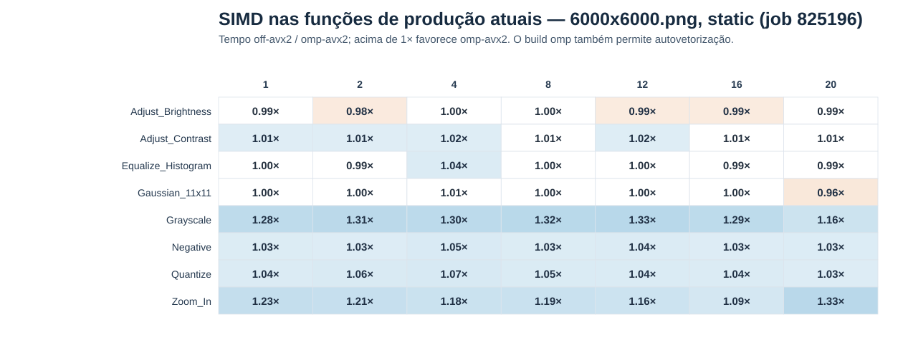
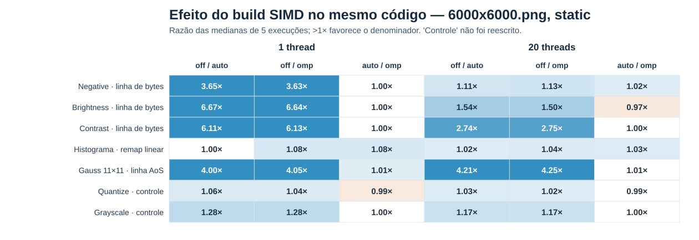
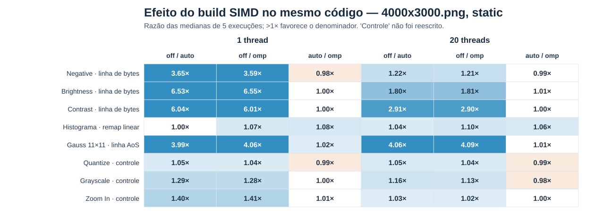

# SIMD no processamento de imagens: pragma inicial e reorganização dos laços

Este relatório usa o job **825196** como referência das funções de produção na revisão atual e o job **825200** para as variantes com laços reestruturados. O objetivo é distinguir três efeitos: mudar a organização do código, permitir vetorização automática ao GCC e acrescentar o pragma explícito. A seção final seleciona três transformações para a apresentação de aproximadamente cinco minutos dedicada a SIMD.

## Como ler os resultados

- `off-avx2`: alvo Haswell, mas vetorização automática de **laços** desativada por `-fno-tree-vectorize`. O nome não significa ausência absoluta de instruções vetoriais.
- `auto-avx2`: mesmo alvo e código, vetorização automática permitida, sem `EXP_SIMD`/`OMP_SIMD`.
- `omp-avx2`: mesmo alvo e código, com os pragmas OpenMP SIMD explícitos.
- Uma razão `tempo A / tempo B` **maior que 1** favorece B. Cada célula abaixo divide **medianas**, não combina tempos de execuções individuais.
- `#pragma omp parallel for schedule(runtime)` distribui iterações entre threads; `#pragma omp simd` pede vetorização das iterações de um laço. São decisões distintas.

### O que o primeiro mapa divide — e como os três builds foram compilados

O mapa principal do job **825196** mostra **`mediana(off-avx2) / mediana(omp-avx2)`**, e **não** `off-avx2 / auto-avx2`. Por exemplo, a célula `Grayscale, 1 thread` divide 78,01 ms por 61,14 ms ≈ 1,28×; `Zoom_In, 1 thread` divide 350,25 ms por 285,54 ms ≈ 1,23×. Uma célula acima de 1× indica que `omp-avx2` foi mais rápido. Esse contraste junta a vetorização automática habilitada **e** a possível contribuição dos pragmas. Para separar os efeitos, o mesmo [resumo CSV](resultados_pcad_hype_simd_followup_825196/simd_followup_summary.csv) contém `Off_over_Auto` e `Auto_over_Omp`; o [índice de gráficos](resultados_pcad_hype_simd_followup_825196/visualizacoes/index.html) também oferece os dois mapas correspondentes.

O [script executado no job](run_simd_followup_tests.sh#L53) chamou, a partir da raiz do projeto, estes comandos (um por build):

```bash
make -B DEBUG=1 SIMD=off-avx2  COMPILER_DIAGNOSTICS=1 all vectorization
make -B DEBUG=1 SIMD=auto-avx2 COMPILER_DIAGNOSTICS=1 all vectorization
make -B DEBUG=1 SIMD=omp-avx2  COMPILER_DIAGNOSTICS=1 all vectorization
```

`-B` força a recompilação; `all` produz `build/<build>/image_benchmark` e `vectorization` produz `build/<build>/vectorization_benchmark`. Para **todos** os arquivos C++ desses executáveis, o [Makefile](Makefile#L36) passou `-O3 -Wall -Wextra -std=c++17 -fopenmp -ffp-contract=off -g`, acrescidos exatamente dos seguintes parâmetros de cada build:

| Build | Parâmetros adicionais passados ao GCC | Significado |
| --- | --- | --- |
| `off-avx2` | `-DOMP_EXPLICIT_SIMD=0 -fno-tree-vectorize -march=haswell` | Alvo AVX2/Haswell, mas sem a passada de vetorização automática de laços; o macro `OMP_SIMD` fica vazio. |
| `auto-avx2` | `-DOMP_EXPLICIT_SIMD=0 -march=haswell` | Mesmo alvo; o GCC pode vetorizar automaticamente, mas `OMP_SIMD` fica vazio. |
| `omp-avx2` | `-DOMP_EXPLICIT_SIMD=1 -march=haswell` | Mesmo alvo e vetorização automática habilitada; `OMP_SIMD` expande para `_Pragma("omp simd")`. |

Como `COMPILER_DIAGNOSTICS=1`, a compilação de `image_manipulation.cpp` acrescentou `-fopt-info-vec-all=build/<build>/vectorization-core-all.log`, e a de `vectorization_benchmark.cpp` acrescentou `-fopt-info-vec-all=build/<build>/vectorization-experiment-all.log`. Essas opções **geram relatórios**, não constituem uma quarta modalidade de SIMD. O Makefile também passa `-I577262-FPI-Relatorio2`, macros que registram o build/flags no CSV e `-MMD -MP` para dependências; a ligação usa `g++ -fopenmp`. Os builds de benchmark usam o mesmo código-fonte, mas os pragmas são ativados somente no terceiro caso. A [versão do compilador registrada](resultados_pcad_hype_simd_followup_825196/compiler.txt) e as flags por execução em [original_raw.csv](resultados_pcad_hype_simd_followup_825196/original_raw.csv) permitem auditar o ambiente efetivamente usado, não apenas a receita do Makefile.

A campanha anterior **822851** pertence a uma revisão mais antiga e **não fornece o mapa principal deste relatório**. Seu [mapa histórico](visualizacoes_pcad_hype_final_simd_avx2_adaptativo/figures/01_simd_avx2_resumo_apresentacao.svg) continua acessível apenas para rastrear a evolução, não para ser apresentado como controle do 825200. Para quantificar o efeito de SIMD, compare builds **dentro da mesma campanha e variante**. Os jobs 825196 e 825200 ainda rodaram em nós distintos e registraram hashes distintos de `vectorization_benchmark.cpp` ([825196](resultados_pcad_hype_simd_followup_825196/source_sha256.txt), [825200](resultados_pcad_hype_linear_simd_825200/source_sha256.txt)), embora o hash de `image_manipulation.cpp` seja igual. Não dividir tempos absolutos de um job pelos do outro.

## 1. Funções de produção atuais: pragma na estrutura sem reescrita experimental



O [CSV de suporte do job 825196](resultados_pcad_hype_simd_followup_825196/simd_followup_summary.csv) usa a imagem 6000×6000, `static`, cinco medições e threads 1, 2, 4, 8, 12, 16 e 20. O mapa reúne as oito funções de produção selecionadas, **inclusive Zoom In**. Flip e rotações não aparecem porque seus laços originais não receberam o pragma. `off/omp` mede o efeito combinado de permitir vetorização e usar os pragmas; para isolar a contribuição do pragma, consultar `auto/omp` no mesmo CSV. Grayscale foi refatorado antes desta campanha, mas não foi reescrito no experimento 825200.

| Função original | `off/omp`, 1 thread | `off/omp`, 20 threads | Leitura |
| --- | ---: | ---: | --- |
| Negative | 1,03× | 1,03× | Efeito pequeno. |
| Adjust_Brightness | 0,99× | 0,99× | Sem ganho. |
| Adjust_Contrast | 1,01× | 1,01× | Efeito pequeno. |
| Equalize_Histogram | 1,00× | 0,99× | Sem ganho no total. |
| Gaussian_11x11 | 1,00× | 0,96× | O pragma no laço de pixels não acelerou a convolução. |
| Grayscale | 1,28× | 1,16× | GCC vetorizou o laço atual; `auto/omp` ≈ 1. |
| Quantize | 1,04× | 1,03× | Ganho pequeno; houve vetorização automática na redução min/max, não no remapeamento final. |
| Zoom_In | 1,23× | 1,33× | Ganho visível; em 20 threads, `off` teve dispersão alta. |

O problema não é uma dependência matemática entre pixels em Negative, Contrast ou Gaussiana. O pragma estava posicionado antes do laço de **pixels**, cujo corpo ainda continha trabalho por canal ou um ninho inteiro de convolução. No caso de Contrast, o [código de produção](577262-FPI-Relatorio2/image_manipulation.cpp#L901) era:

```cpp
#pragma omp parallel for schedule(runtime)
for (int i = 0; i < img.height; ++i) {
    OMP_SIMD                         // #pragma omp simd apenas em omp-avx2
    for (int j = 0; j < img.width; ++j) {  // pixels: o GCC não vetorizou este laço
        const int index = (i * img.width + j) * 3;
        for (int channel = 0; channel < 3; ++channel) {
            const float value = img.data[index + channel] * contrast_factor;
            img.data[index + channel] =
                static_cast<unsigned char>(std::clamp(static_cast<int>(value), 0, 255));
        }
    }
}
```

O [diagnóstico GCC do próprio job 825196](resultados_pcad_hype_simd_followup_825196/omp-avx2-core-focus.txt) registra `multiple nested loops` no laço de pixels de Contrast (linha 907), de Brightness (1016) e da Gaussiana (523). Ele **não confirma** que esses laços foram vetorizados. Em contraste, confirma vetores de 32 bytes no laço atual de Grayscale (linha 979). O ganho de Grayscale em `off/omp` não é ganho *incremental* do pragma: no mesmo job, `off/auto` ≈ 1,29× e `auto/omp` ≈ 0,99× em uma thread. O caso Zoom In exige análise das suas fases, não a conclusão genérica de que todo pragma funcionou; ver [auditoria dos laços originais](RELATORIO_LOOPS_SIMD_17_OPERACOES.md).

**O Quantize foi vetorizado? Parcialmente.** A [função de produção](577262-FPI-Relatorio2/image_manipulation.cpp#L1072) primeiro chama Grayscale quando necessário, depois procura luminâncias mínima e máxima e, por fim, remapeia cada pixel para um nível. Tanto o [relatório `auto-avx2`](resultados_pcad_hype_simd_followup_825196/auto-avx2-core-focus.txt) quanto o [relatório `omp-avx2`](resultados_pcad_hype_simd_followup_825196/omp-avx2-core-focus.txt) marcam o laço interno da **busca min/max, linha 1079**, como `loop vectorized using 32 byte vectors` (também há versão de 16 bytes). Já o laço de **remapeamento, linha 1104**, aparece como `missed` nos dois relatórios; o pragma está sobre esse laço em `omp-avx2`, mas não fez o GCC vetorizá-lo. No job 825196, com 1 thread, `off/auto` ≈ **1,056×**, enquanto `auto/omp` ≈ **0,987×**: a versão com pragma foi ligeiramente mais lenta que a automática. O tempo total inclui também a conversão para cinza, então não é possível atribuir os ~5,6% de `off/auto` exclusivamente à busca min/max. A conclusão precisa é: **há pelo menos um laço vetorizado dentro de Quantize, mas não o laço final que recebeu o pragma**.

## 2. Segunda abordagem: expor laços longos e independentes

Na campanha **825200**, a aritmética ponto a ponto, os 121 pesos `float` da Gaussiana e a contagem/normalização do histograma foram mantidos. Mudou-se a ordem em que os elementos são percorridos. Os controles Quantize, Grayscale e Zoom In **não foram reescritos** nessa campanha. Cada configuração teve aquecimento, cinco medições e validação exata dos bytes de saída. [Protocolo](resultados_pcad_hype_linear_simd_825200/protocol.txt), [amostras brutas](resultados_pcad_hype_linear_simd_825200/linear_simd_raw.csv) e [resumo](resultados_pcad_hype_linear_simd_825200/linear_simd_summary.csv).





Esses mapas mostram `off/auto`, `off/omp` e `auto/omp` **dentro da mesma variante**, em 1 e 20 threads. O mapa de 36 MP não tem Zoom In; o de 12 MP tem. A tabela abaixo seleciona as razões que separam o ganho da vetorização automática da contribuição adicional do pragma:

| Variante medida | `off/auto` 1 t | `auto/omp` 1 t | `off/auto` 20 t | `auto/omp` 20 t |
| --- | ---: | ---: | ---: | ---: |
| Negative, bytes lineares | 3,65× | 1,00× | 1,11× | 1,02× |
| Brightness, bytes lineares | 6,67× | 1,00× | 1,54× | 0,97× |
| Contrast, bytes lineares | 6,11× | 1,00× | 2,74× | 1,00× |
| Histograma, remapeamento linear, **total** | 1,00× | 1,08× | 1,02× | 1,03× |
| Gaussiana 11×11, linha AoS | 4,00× | 1,01× | 4,21× | 1,01× |
| Quantize, controle | 1,06× | 0,99× | 1,03× | 0,99× |
| Grayscale, controle | 1,28× | 1,00× | 1,18× | 1,00× |
| Zoom In, controle **12 MP** | 1,40× | 1,01× | 1,03× | 1,00× |

As razões são das medianas de `total` em [linear_simd_summary.csv](resultados_pcad_hype_linear_simd_825200/linear_simd_summary.csv), arredondadas a duas casas. Não atribuir o ganho `original/candidata` exclusivamente a SIMD: a estrutura do laço também mudou. A [tabela do efeito estrutural](resultados_pcad_hype_linear_simd_825200/figures/efeito_estrutura.csv) compara as duas implementações **dentro do mesmo build** e responde a outra pergunta.

### 2.1 Operações ponto a ponto: Contrast representa Negative e Brightness

No [candidato Contrast](577262-FPI-Relatorio2/vectorization_benchmark.cpp#L213), a linha RGB continua no formato intercalado `RGBRGB…` (AoS). Não há SoA, lookup nem nova fórmula. Sai o laço de três canais por pixel; entra um laço sobre todos os bytes adjacentes da linha:

```cpp
void contrast_linear(Byte* data, int width, int height) {
    #pragma omp parallel for schedule(runtime)
    for (int y = 0; y < height; ++y) {
        Byte* row = data + static_cast<size_t>(y) * width * 3;
        EXP_SIMD  // #pragma omp simd apenas no build omp-avx2
        for (int byte = 0; byte < width * 3; ++byte) {  // LAÇO VETORIZADO
            const float value = row[byte] * 1.5f;
            row[byte] = static_cast<Byte>(
                std::clamp(static_cast<int>(value), 0, 255));
        }
    }
}
```

O laço `y` continua distribuído por OpenMP; o laço `byte` oferece operações independentes sobre posições consecutivas. O [GCC em `auto-avx2`](resultados_pcad_hype_linear_simd_825200/auto-avx2-compiler-focus.txt) registra na linha 218 `loop vectorized using 32 byte vectors` e também uma versão de 16 bytes. As linhas 199 e 208 confirmam o mesmo tipo de laço para Negative e Brightness. O [log `omp-avx2`](resultados_pcad_hype_linear_simd_825200/omp-avx2-compiler-focus.txt) também confirma 32 bytes. As mensagens `missed` para o laço externo ou para uma análise do acesso **não anulam** o `optimized` do laço interno. Vetores de 32 bytes dizem a largura da operação escolhida, não que cada instrução processe 32 multiplicações `float` de uma vez: o GCC ainda precisa converter bytes, fazer a aritmética e limitar a faixa.

Como controle de interpretação, na imagem de 36 MP com uma thread, `original/linear_bytes` em `auto-avx2` é **7,75×** para Negative, **13,16×** para Brightness e **9,10×** para Contrast. Esses números incluem a mudança da estrutura do código; a coluna `off/auto` da tabela principal é a comparação apropriada para perguntar o que a vetorização acrescentou **ao novo laço**. Em 20 threads, os ganhos `off/auto` são menores, coerentes com uma parcela maior do tempo sendo limitada por trânsito de dados, concorrência e custos fixos; este ensaio sozinho não separa essas causas.

### 2.2 Gaussiana 11×11: SIMD ao longo da linha, não dentro do pixel

O [código original](577262-FPI-Relatorio2/image_manipulation.cpp#L520) coloca `OMP_SIMD` no laço de `i`, e cada iteração chama [`apply_11_by_11_convolution_to_pixel`](577262-FPI-Relatorio2/image_manipulation.cpp#L226). Dentro da função, dois laços sobre `k` e `l` realizam 121 contribuições para **um único pixel RGB**, com três acumuladores `float`. O GCC reportou o ninho como obstáculo à vetorização do laço de pixels. Tentar apenas vetorizar os 11 produtos de `l` não é equivalente a processar vários pixels de saída por vetor.

Na [variante controlada por linha](577262-FPI-Relatorio2/vectorization_benchmark.cpp#L520), o kernel continua sendo a convolução **direta** com 121 pesos `float` e layout AoS. Cada thread dispõe de acumuladores temporários para uma linha; para cada peso, percorre bytes de **muitos pixels de saída**:

```cpp
#pragma omp parallel
{
    std::vector<float> sums(static_cast<size_t>(row_bytes)); // privado por thread
    #pragma omp for schedule(runtime)
    for (int y = 0; y < output.height; ++y) {
        std::fill(sums.begin(), sums.end(), 0.0f);
        for (int k = -5; k <= 5; ++k)
            for (int l = -5; l <= 5; ++l) {
                const float weight = GAUSSIAN_KERNEL_11X11[5 + k][5 + l];
                const Byte* source = /* linha de entrada deslocada por k,l */;
                EXP_SIMD
                for (int byte = 0; byte < row_bytes; ++byte) // LAÇO VETORIZADO
                    sums[byte] += weight * source[byte];
            }
        // converter os acumuladores e gravar a linha RGB de saída
    }
}
```

O bloco acima abrevia somente o cálculo do ponteiro e a gravação final; o [trecho integral](577262-FPI-Relatorio2/vectorization_benchmark.cpp#L520) está no código. `k` e `l` percorrem os pesos em ordem, preservando a sequência de soma de cada byte de saída. O [GCC `auto-avx2`](resultados_pcad_hype_linear_simd_825200/auto-avx2-compiler-focus.txt) registra na linha 534 `loop vectorized using 32 byte vectors`; o [GCC `omp-avx2`](resultados_pcad_hype_linear_simd_825200/omp-avx2-compiler-focus.txt) confirma o mesmo na linha 535. A vetorização atravessa **posições da linha** para um peso fixo, não os 11 taps que produzem um pixel. Nenhuma separação horizontal/vertical do filtro foi aplicada.

O controle mais esclarecedor é o resultado **dentro do job 825200**, 36 MP e uma thread:

| Implementação do kernel, saída pré-alocada | `off-avx2` | `auto-avx2` | `omp-avx2` |
| --- | ---: | ---: | ---: |
| Por pixel (`pixel_outer`) | 9,26 s | 9,26 s | 9,28 s |
| Por linha AoS (`row_linear_aos`) | 11,49 s | 2,87 s | 2,84 s |

Sem vetorização automática, a candidata por linha foi **mais lenta**: o buffer de acumuladores e a nova organização têm custo. Com o GCC vetorizando a linha, ela fica **4,00×** mais rápida que sua própria versão `off` e **3,23×** mais rápida que `pixel_outer` no mesmo build `auto`. O pragma adicional representa apenas **1,01×**. Em 20 threads, `row_linear_aos` cai de 666,6 ms (`off`) para 158,3 ms (`auto`) e 156,9 ms (`omp`); as cinco amostras têm [mínimo e máximo no CSV](resultados_pcad_hype_linear_simd_825200/linear_simd_summary.csv). A saída foi validada byte a byte contra `pixel_outer` e contra a função de produção no pré-voo. As duas variantes desse ensaio recebem a saída pré-alocada: não comparar esses segundos diretamente ao tempo da função de produção que aloca seu próprio buffer.

O [job 825196](resultados_pcad_hype_simd_followup_825196/simd_followup_summary.csv) fornece um teste secundário, não uma razão cruzada com o 825200. Nele, `float_tap_products` (produtos de 11 taps por pixel, soma serial preservada) piorou de 9,27 para 11,13 s entre `off` e `omp`, em uma thread. `float_row_aos` repetiu o ganho qualitativo, de 11,50 para 2,62 s. `float_row_soa` também foi rápido, mas **inclui conversões de layout** no `total`; não é evidência isolada da linearização AoS. Isso reforça que **qual dimensão do laço** é vetorizada importa mais que apenas obter alguma instrução vetorial.

### 2.3 Histograma: o remapeamento fica vetorizável, a contagem não

A função de produção [Equalize_Histogram](577262-FPI-Relatorio2/image_manipulation.cpp#L861) primeiro chama `compute_normalized_cummulative_histogram`; depois remapeia cada pixel por meio de um laço de três canais. O experimento [825200](577262-FPI-Relatorio2/vectorization_benchmark.cpp#L735) chama a **mesma** função de contagem, redução e normalização. Só troca a travessia da fase final:

```cpp
void histogram_remap_linear(Byte* data, int width, int height,
                            const unsigned int bins[256]) {
    #pragma omp parallel for schedule(runtime)
    for (int y = 0; y < height; ++y) {
        Byte* row = data + static_cast<size_t>(y) * width * 3;
        EXP_SIMD
        for (int byte = 0; byte < width * 3; ++byte) // LAÇO VETORIZADO EM omp-avx2
            row[byte] = static_cast<Byte>(bins[row[byte]]);
    }
}
```

O acesso à **imagem** é linear; o acesso aos 256 `bins` continua indexado pelo valor do pixel. Por isso não se deve descrevê-lo como uma simples soma vetorial contígua. No [log `auto-avx2`](resultados_pcad_hype_linear_simd_825200/auto-avx2-compiler-focus.txt), a linha 295 tem `data ref analysis failed` e não apresenta confirmação de vetorização desse laço. No [log `omp-avx2`](resultados_pcad_hype_linear_simd_825200/omp-avx2-compiler-focus.txt), a mesma linha também contém um diagnóstico `missed` de análise, **mas** registra `optimized: loop vectorized using 32 byte vectors` para o laço. Isso confirma uma versão vetorizada; não prova que o lookup se tornou barato.

Em 36 MP e uma thread, o `remap` mediano passa de aproximadamente **58,17 ms** (`auto`) para **47,21 ms** (`omp`), cerca de **1,23×**. Já a fase `count_and_normalize` fica próxima de **90,7 ms** nas três builds. No `total`, a diferença vira **148,93 → 137,99 ms**, ou **1,08×**. Com 20 threads, o ganho total `auto/omp` é cerca de **1,03×**; nesse ponto a dispersão das cinco medições recomenda não alegar um ganho estável de poucos por cento. Não afirmar que o pragma vetorizou a **contagem**: ela contém atualizações indexadas à mesma tabela e uma redução OpenMP, não o laço linear mostrado acima.

## Conclusões que os dados permitem

1. Nas funções de produção medidas pelo 825196, permitir vetorização pouco mudou a maioria dos tempos; **Grayscale e Zoom In são exceções visíveis**. A diferença `auto/omp` próxima de 1 em ambos indica que seus ganhos não vêm principalmente de acrescentar o pragma. Os diagnósticos GCC apontam o ninho de laços como obstáculo para Contrast, Brightness e Gaussiana. Isso **não** quer dizer que SIMD seja inútil para essas operações.
2. Nos candidatos ponto a ponto e na Gaussiana por linha, o GCC vetorizou laços contíguos **mesmo sem pragma**, e as medições `off/auto` mostram ganhos claros. O ganho do programa inteiro ao trocar original por candidata também contém o efeito da estrutura do código.
3. O histograma mostra a exceção instrutiva: o pragma confirmou vetorização do **remapeamento** que o GCC automático não confirmou, mas a fase de contagem limita o ganho do tempo total.
4. Os relatórios do GCC identificam a escolha do laço e a largura de 32 bytes; não fornecem, sozinhos, a contagem dinâmica de instruções ou a causa microarquitetural exata de cada diferença. O protocolo dos jobs não foi um estudo de montagem/VTune isolando cada instrução.
5. A campanha controlada não reexecutou Gaussian_3x3, 5x5, 7x7 e 9x9. O resultado de 11×11 não deve ser apresentado como medição de todos os tamanhos.

## Três exemplos para os slides de SIMD

A apresentação completa dura dez minutos, dos quais **até cinco** ficam para esta parte; a comparação entre `static` e `dynamic` ocupa o restante. Três trechos de código bastam. O relatório acima fica como material de apoio, não como roteiro para projetar todas as tabelas.

| Tempo sugerido | Exibir | Frase central |
| --- | --- | --- |
| 0:35 | Problema e builds `off/auto/omp` | “SIMD é uma hipótese de paralelismo dentro do núcleo; vamos observar o que o GCC realmente gerou.” |
| 0:55 | [Mapa das funções de produção atuais, job 825196](resultados_pcad_hype_simd_followup_825196/visualizacoes/figures/01_simd_producao_atual_825196.svg) | “A maioria pouco mudou; Grayscale e Zoom ganharam com a vetorização, mas quase nada com o pragma além do GCC automático.” |
| 0:55 | **Contrast** original → laço de bytes, com linha 218 do log GCC | “O novo laço expõe muitos bytes independentes e contíguos; o GCC usa vetores de 32 bytes automaticamente.” |
| 1:05 | **Gaussiana** por pixel → por linha, com a tabela 9,26/11,49/2,87 s | “Vetorizar 11 coeficientes de um pixel não é o mesmo que vetorizar muitos pixels; a segunda organização permitiu o ganho.” |
| 0:45 | **Histograma**: código do remapeamento e fases | “O remapeamento vetorizou com pragma, mas a contagem domina parte do tempo total.” |
| 0:35 | [Segundo mapa de 36 MP](resultados_pcad_hype_linear_simd_825200/figures/simd_mesma_variante_36mp.svg) e passagem | “Código favorável + decisão do compilador + medição: os três são necessários para interpretar SIMD.” |

Total: aproximadamente **4:50**, com pequena margem. Para o slide, mostre apenas as linhas marcadas `LAÇO VETORIZADO` e seus equivalentes antigos; deixe os logs completos e o [mapa de 12 MP](resultados_pcad_hype_linear_simd_825200/figures/simd_mesma_variante_12mp.svg) para perguntas. Não chamar a Gaussiana por linha de “SoA” ou “separável”: ela é **AoS e convolução direta**.
